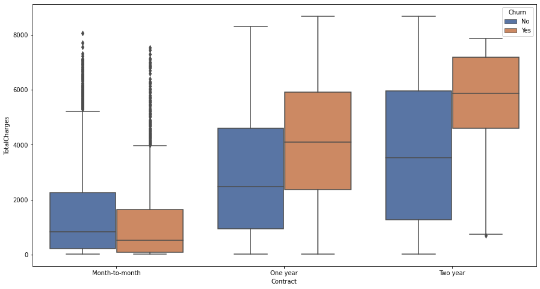
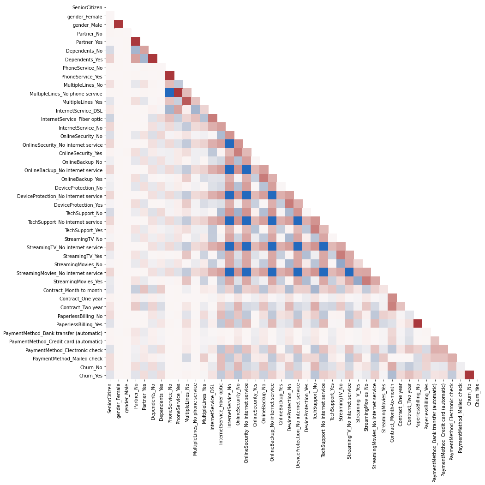
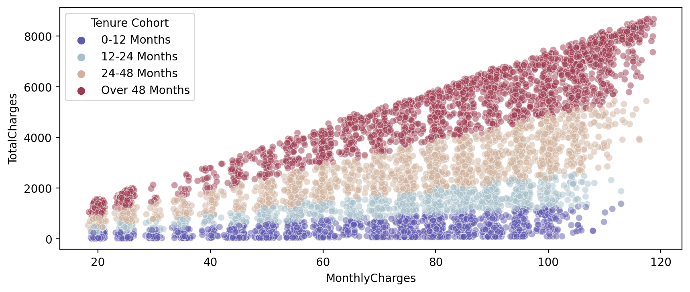
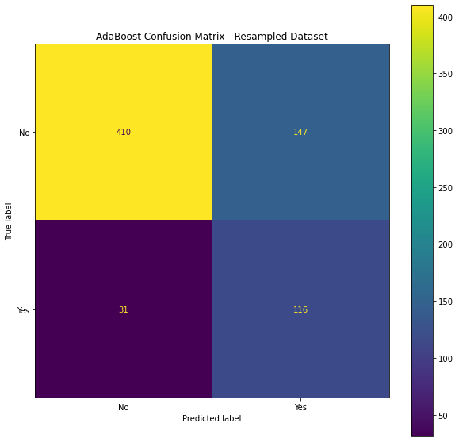

## Table of Contents

- [Project Overview](#project-overview)
- [Project Organization](#project-organization)
- [Installation](#installation)
   

## Project Overview
Business churn (rate of attrition) is an incredibly important part of understanding subscription-centric businesses. 

If a firm can answer the following questions, they will be well positioned to understand their customer base and stay ahead in their competitive landscapes:
- Are customers more likely to leave after a certain time period? 
- Are customers who quit paying more?
- Is there something we can potentially do to keep customers longer?
- Can we predict which customers are more likely to leave, given certain characteristics of each customer?

#### The repo is meant to look at all those questions through the following sections using sample data of a Telecom company.

Using a `jupyter notebook`, analysis is broken out by the following sections:
- Exploratory data analysis
    - Data manipulation with `pandas`
    - Data visualization with `seaborn` and `matplotlib` 
    
    
- Customer segmentation and churn analysis
    
- Machine Learning
    - `sklearn`
    - Classification problem
        - DecisionTree
        - RandomForest
        - AdaBoost
        - GradientBoost
      


[(Back to top)](#table-of-contents)


## Project Organization


    │
    ├── data/                <- The original, immutable data dump. 
    │
    ├── notebooks/           <- Jupyter notebooks. 
    │
    ├── figures/             <- Charts and sample visualizations.
    │
    ├── LICENSE
    │
    ├── requirements.txt     <- pip package dependencies.   
    │
    ├── README.md            <- Project summary and instructions.
    │


[(Back to top)](#table-of-contents)

## Installation

Clone this repo locally:

```sh
$ git init
$ git clone https://github.com/Robert-F-Mulligan/customer-churn-analysis.git
```

Install the virtual environment:

```sh
$ python -m venv /path/to/new/virtual/environment
```
Activate virtual environment:
```sh
$ cd /path/to/new/virtual/environment/Scripts/activate 
```


Install project dependencies through pip and requirements.txt:

```sh
$ pip install -r requrements.txt
```

Install a new ipython kernel:

```sh
$ ipython kernel install --user --name=churnanalysis
```

To run Jupyter Notebook and open the notebooks in `.notebooks/`:

```sh
$ jupyter notebook
```
Select the new kernel churnanalysis

[(Back to top)](#table-of-contents)
